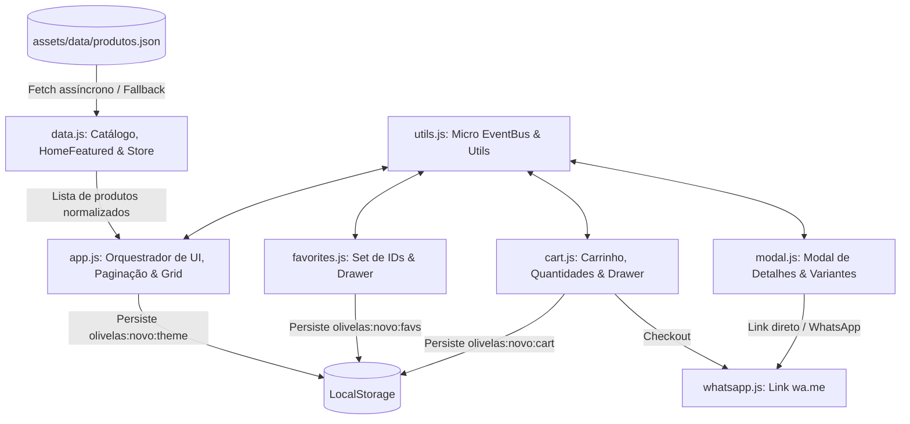

# AI_CONTEXT.md — Guia de Contexto Integral para Inteligências Artificiais

> **AVISO PARA FUTURAS IAs / AGENTES AUTÔNOMOS:**  
> Este documento é a especificação canônica e completa do projeto **OLIVELAS — Catálogo Digital PWA**. Ele foi elaborado para que você compreenda 100% da arquitetura, decisões técnicas, regras de negócio implícitas, estruturas mentais, padrões de código e diretrizes de extensão sem precisar inspecionar previamente o histórico ou código-fonte.  
> **Leia este documento atentamente antes de propor ou aplicar qualquer modificação no sistema.**

---

## 1. Filosofia do Projeto e Mental Model

### 1.1. Propósito do Sistema
O **OLIVELAS** é um catálogo digital headless de alto padrão estético para velas artesanais, aromatizadores e acessórios aromáticos. O sistema combina a elegância visual de uma marca de luxo com a agilidade de um **Single-Page Application (SPA) / Progressive Web App (PWA)**, operando em arquitetura **Jamstack Zero-Build**.

### 1.2. Estrutura Mental do Sistema (Mental Model)
```
+----------------------------------------------------------------------------------------------------+
|                                    ESTRUTURA MENTAL DO SISTEMA                                     |
+----------------------------------------------------------------------------------------------------+
|                                                                                                    |
|   1. FONTE DA VERDADE (Single Source of Truth)                                                    |
|      - Arquivo: assets/data/produtos.json                                                          |
|      - NADA é fixo no HTML (produtos, categorias, cores da marca, Google Fonts, dados do WhatsApp).|
|      - O JSON é a única fonte que governa o catálogo, identidade visual e SEO dinâmico.            |
|                                                                                                    |
|   2. NORMALIZAÇÃO HIERÁRQUICA -> REGISTROS PLANOS COM CHAVE PRIMÁRIA `uid`                         |
|      - Hierarquia JSON: Categorias -> Produtos (OV01) -> Tamanhos (Mini, Padrão)                   |
|      - Modelo em Memória: Lista plana de variantes onde a chave primária única é o `uid`:          |
|        Ex: "OV01-mini" (Mini 40g) vs "OV01-padrao" (Padrão 230g)                                   |
|      - Cada `uid` tem sua própria foto, peso, preço, status de estoque e favorito independente.    |
|                                                                                                    |
|   3. DESACOPLAMENTO TOTAL VIA MICRO EVENTBUS (Pub/Sub)                                             |
|      - Módulos ES6 não possuem dependências circulares.                                            |
|      - Comunicação entre busca, filtros, carrinho, favoritos, tema e modal ocorre via `bus.emit()`.|
|                                                                                                    |
|   4. JAMSTACK ZERO-BUILD / VANILLA PURO                                                            |
|      - Sem Webpack, Vite, Babel, React ou frameworks pesados.                                      |
|      - JavaScript nativo (ES Modules), CSS modular em camadas, SVGs inline zero-dependency.        |
|                                                                                                    |
|   5. ZERO-BACKEND SERVERLESS (E-Commerce sem Banco de Dados Central)                               |
|      - Persistência de Estado do Cliente: LocalStorage (Carrinho, Favoritos, Tema).                |
|      - Checkout: WhatsApp Gateway com mensagens formatadas em URI (`wa.me`).                       |
|      - Cache & Offline: Service Worker com estratégias híbridas (Network-First / SWR).             |
+----------------------------------------------------------------------------------------------------+
```

---

## 2. Padrões de Arquitetura e Decisões Técnicas



### 2.1. Matriz de Decisões Arquiteturais e Racional
| Decisão Arquitetural | Implementação | Motivo / Racional |
|---|---|---|
| **Zero-Build (ES Modules nativos)** | `<script type="module" src="assets/js/app.js">` | Elimina complexidade de pipeline de build, vulnerabilidades de `node_modules` e permite deploy estático instantâneo. |
| **Fallback Resiliente de Dados** | `FALLBACK_DATA` em `data.js` | Garante renderização instantânea mesmo se o fetch do JSON falhar ou demorar na rede. |
| **Tokens CSS em Dois Níveis** | `--brand-*` (Marca) vs `--color-*` (Semântica) | Permite que o tema escuro inverta cores da interface sem corromper as cores institucionais. |
| **EventBus Desacoplado** | `bus` em `utils.js` | Evita dependência circular e acoplamento rígido entre componentes da UI. |
| **Busca com Normalização NFD** | `s.normalize("NFD").replace(/\p{M}/gu, "")` | Torna a busca insensível a maiúsculas, minúsculas, acentos e cedilhas. |
| **Paginação Editorial Dinâmica** | Pills de tamanho e slots inteligentes | Permite escolher 6, 12, 18 ou todos os itens com paginação fluida e acessível. |
| **Backup Automático do Legado** | `layout_antigo.zip` | Preserva histórico completo de produção sem poluir a árvore do repositório. |

---

## 3. Estrutura de Diretórios e Módulos

```
site-olivelas/
├── 404.html                     # Página de erro 404 com tema adaptativo e design dourado
├── index.html                   # Shell principal (Hero, Pilares, Coleção, Destaques, Ateliê, Pedidos)
├── manifest.webmanifest         # Manifesto PWA com shortcuts e ícones maskable
├── offline.html                 # Página offline servida pelo Service Worker
├── sw.js                        # Service Worker v12 (Network-First + Stale-While-Revalidate)
├── layout_antigo.zip            # Arquivo ZIP com backup do layout e ativos brutos legados
├── AI_CONTEXT.md                # Este documento (Contexto canônico para IA)
├── docs/                        # Wiki modular navegável do projeto
│   ├── README.md                # Hub central da Wiki
│   ├── architecture.md          # Arquitetura e ciclo de vida
│   ├── data-schema.md           # Schema de dados detalhado (homeFeatured, categorias, tags)
│   ├── state-and-events.md      # EventBus e estado reativo
│   ├── catalog-engine.md        # Motor de busca, filtros de categoria e paginação
│   ├── cart-and-favorites.md    # Carrinho, favoritos e travas de estoque/em breve
│   ├── ui-and-design-system.md  # Tokens CSS, tipografia editorial e componentes
│   ├── modal-and-routing.md     # Modal de produto e seletor de variantes
│   ├── media-pipeline.md        # Processamento de imagens e assets visuais
│   ├── session-history-and-prompts.md # Histórico detalhado de prompts e evolução
│   └── pwa-and-offline.md       # PWA e Service Worker
├── assets/
│   ├── css/
│   │   ├── variables.css        # Design tokens em dois níveis (--brand-* vs --color-*)
│   │   ├── style.css            # Reset moderno, tipografia e utilitários
│   │   ├── layout.css           # Header sticky glassmorphism, hero, grid e footer
│   │   ├── components.css       # Cards, botões, pills, paginação, modal, badges e toasts
│   │   └── responsive.css       # Breakpoints para 1024px, 768px e 480px
│   ├── data/
│   │   └── produtos.json        # Base de dados central (velas, kits, aromatizadores, acessórios, homeFeatured)
│   ├── images/
│   │   ├── logo.png             # Logotipo padrão
│   │   ├── logo-light.svg/.png  # Logotipo oficial tema claro (texto preto)
│   │   ├── logo-dark.svg/.png   # Logotipo oficial tema escuro (texto marfim)
│   │   ├── monogram.svg         # Símbolo oficial da chama dourada isolada
│   │   ├── og-cover.webp        # Imagem OpenGraph social (1200x630px)
│   │   ├── placeholder.webp     # Imagem de fallback com monograma
│   │   ├── icons/               # Favicons e ícones PWA (16, 32, 180, 192, 512px)
│   │   │   └── aromas/          # Ícones autorais de famílias olfativas
│   │   └── products/            # Fotos tratadas de produtos e miniaturas
│   └── js/
│       ├── utils.js             # EventBus, helpers DOM, debounce, formatadores
│       ├── data.js              # Carregador de dados, fallback e resoluções de paths
│       ├── cart.js              # Modelo de carrinho, drawer lateral e WhatsApp checkout
│       ├── favorites.js         # Persistência de favoritos e drawer lateral
│       ├── modal.js             # Modal de detalhes e seletor de tamanhos
│       ├── whatsapp.js          # Gerador de links wa.me formatados
│       └── app.js               # Orquestrador da aplicação, busca, paginação e filtros
└── test/
    └── unit.test.mjs            # Suíte completa com 48 asserções automatizadas
```

---

## 4. Regras de Negócio e Comportamentos Críticos

### 4.1. Regra da Classificação "Esgotado"
1. **Definição**: Um produto ou variante é considerado esgotado se possuir `"esgotado": true`, `"status": "esgotado"` ou `"badge": "Esgotado"`.
2. **Bloqueio de Carrinho**:
   - O botão nos cards da grade e home é substituído por `<button class="btn btn-disabled" disabled>Esgotado</button>`.
   - No modal, o botão de compra é desabilitado (`"Produto esgotado"`) e o CTA do WhatsApp passa a ser `"Avisar quando chegar"`.
   - A função `addItem(uid)` em `cart.js` retorna `false` imediatamente caso o item seja esgotado.
3. **Favoritos Permitidos**:
   - O botão de favoritos (coração) **permanece ativo e funcional**, permitindo que clientes salvem itens esgotados na sua lista de desejos.

### 4.2. Regra de Identificação de Variantes (`uid`)
- Cada aroma possui códigos base (`OV01` a `OV09`, `ARO1` a `ARO3`, `ACC1` e `ACC2`).
- Ao normalizar, cada tamanho vira um `uid` único:
  - `OV01` + Mini -> `OV01-mini`
  - `OV01` + Padrão -> `OV01-padrao`
- O `uid` é a chave usada no carrinho, nos favoritos e no deep linking (`#produto-OV01-mini`).

### 4.3. Regra de Deep Linking e Roteamento Virtual
- A URL hash `#produto-<uid>` abre o modal automaticamente.
- Se o usuário selecionar outra variante no modal, a URL é atualizada via `history.replaceState` sem recarregar a página.
- Fechar o modal remove a hash da URL limpando o histórico.

---

## 5. Padrões de Código e Convenções

### 5.1. JavaScript (ESM Puro)
- **Seletores DOM**: Usar sempre `$(sel, ctx)` e `$$(sel, ctx)` importados de `./utils.js`.
- **Comunicação entre Módulos**: Nunca chamar funções de UI de outros módulos diretamente se houver impacto global; emitir eventos no `bus`.
- **Imutabilidade**: Métodos de filtragem (`getItensFiltrados`) devem retornar novos arrays (`[...list].sort(...)`) sem mutar o estado interno `state.itens`.
- **Formatação Monetária**: Usar sempre `formatCurrency(val)` que utiliza `Intl.NumberFormat('pt-BR', { style: 'currency', currency: 'BRL' })`.

### 5.2. CSS (BEM Simplificado e Variáveis Semânticas)
- **Classes de Estado**: Prefixo `is-*` (ex: `.is-open`, `.is-active`, `.is-locked`, `.is-esgotado`, `.is-scrolled`).
- **Uso de Cores**: Nunca aplicar cores hexadecimais *hardcoded* nos seletores de componentes; utilizar sempre `var(--color-*)` ou `var(--brand-*)`.
- **Transições**: Utilizar as curvas de bezier padronizadas (`var(--ease-out)`, `var(--t-fast)`, `var(--t-med)`).

### 5.3. Convenções de Armazenamento Local (`LocalStorage`)
| Chave | Formato | Exemplo de Valor |
|---|---|---|
| `olivelas:theme` | String | `"light"` ou `"dark"` |
| `olivelas:cart` | JSON Object `{ [uid]: number }` | `{"OV01-mini": 2, "OV05-padrao": 1}` |
| `olivelas:favs` | JSON Array `string[]` | `["OV01-mini", "OV09-padrao"]` |

---

## 6. Integrações e APIs Externas

1. **WhatsApp API Gateway**:
   - Endpoint: `https://wa.me/{numero}?text={mensagem_encoded}`
   - Sanitização de número: `numero.replace(/\D/g, '')` -> `5511963820374`.
   - Codificação de texto: `encodeURIComponent(mensagem)`.
2. **Google Fonts CDN**:
   - Endpoint: `https://fonts.googleapis.com/css2?family={families}&display=swap`.
   - Injetado em runtime com deduplicação via `<link data-fonts>`.
3. **Web Share API**:
   - `navigator.share({ title, text, url })` com fallback automático para cópia de link via Clipboard API.

---

## 7. Performance, Segurança e Observabilidade

### 7.1. Performance
- **Zero Overhead**: Tempo de carregamento inferior a 1 segundo com First Contentful Paint (FCP) ultrarrápido.
- **Lazy Loading**: Imagens utilizam `loading="lazy"` e `decoding="async"`.
- **Formatos Otimizados**: Todas as fotos de produtos em formato WebP moderno de alta compressão (Q95 para fotos principais e Q90 para miniaturas).
- **Service Worker Stale-While-Revalidate**: Assets estáticos são servidos instantaneamente do cache enquanto uma versão atualizada é buscada em background.

### 7.2. Segurança
- **Client-Side Only**: Sem banco de dados exposto, sem endpoints vulneráveis a SQL Injection ou SSRF.
- **Sanitização de Inputs**: O input de busca passa por normalização de caracteres e não é executado via `eval()` ou inserido como HTML inseguro.
- **Links Externos**: Todos os links que abrem novas abas utilizam `target="_blank"` acompanhado obrigatoriamente de `rel="noopener"`.

### 7.3. Observabilidade e Diagnóstico
- Modo de depuração local com servidor estático: `node test/serve.mjs`.
- Suíte automatizada de testes unitários: `node test/unit.test.mjs` (48 testes cobrindo dados, SEO, regras de negócio, travas de carrinho/em breve, paginação e integridade).
- Logs no console padronizados com o prefixo `[olivelas]`.

---

## 8. Limitações Conhecidas e Backlog Técnico

### 8.1. Limitações Atuais
1. **Capacidade do Catálogo**: Projetado para catálogos de pequeno e médio porte (até ~200 produtos). Para catálogos com milhares de itens, seria necessário implementar virtualização de lista (Virtual Scrolling) ou paginação com carregamento sob demanda no servidor.
2. **Estoque em Tempo Real**: O controle de produtos "esgotado" é estático no JSON. Não há backend conectado a ERP em tempo real para decrementar estoque automaticamente.

### 8.2. Backlog Técnico e Pontos de Extensão
- [ ] **Integração com Gateway de Pagamento**: Adicionar checkout direto via Pix (geração de QR Code Pix cópia-e-cola em JavaScript puro) antes de redirecionar para o WhatsApp.
- [ ] **Cálculo de Frete**: Integrar API dos Correios ou Melhor Envio via client-side fetch com CEP do usuário.
- [ ] **Cupom de Desconto**: Criar sistema de cupons com validação no carrinho e cálculo de desconto percentual ou fixo.
- [ ] **Multi-idioma (i18n)**: Suporte a seletor de idiomas (`pt-BR`, `en-US`, `es-ES`) mapeado no JSON.

---

## 9. Como Executar e Validar o Projeto

### Testes Automatizados:
```bash
node test/unit.test.mjs
```

### Servidor Local de Desenvolvimento:
```bash
node test/serve.mjs
# Acessar: http://localhost:3000
```
