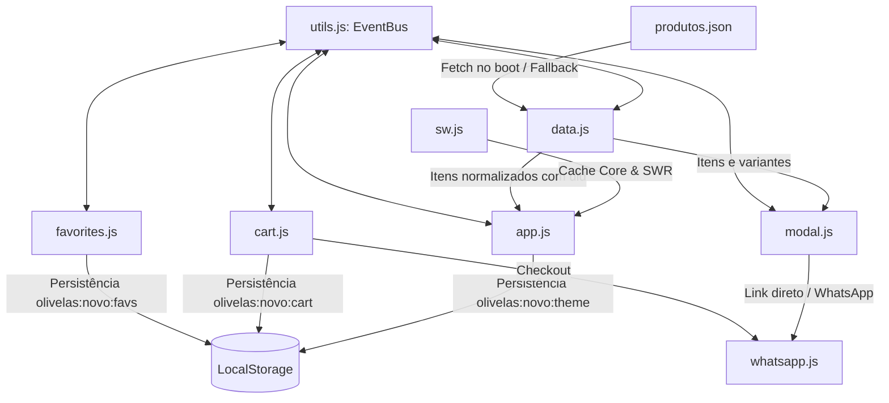

# Documentação Arquitetural — OLIVELAS

Seja bem-vindo à base de conhecimento e documentação arquitetural do projeto **OLIVELAS — Catálogo Digital PWA**.

Esta Wiki reúne todas as decisões estruturais, especificações de módulos, modelos de dados, regras de negócio e fluxos de execução do sistema, organizada de forma modular e hiperconectada.

---

## Estrutura da Wiki

A documentação está dividida nos seguintes domínios:

```
docs/
├── README.md               # Este documento (Índice geral da Wiki)
├── architecture.md         # Visão Geral da Arquitetura e Filosofia do Sistema
├── data-schema.md          # Especificação do Schema Central de Dados (produtos.json)
├── state-and-events.md     # Gerenciamento de Estado, EventBus e Ciclo de Vida
├── catalog-engine.md       # Normalização de Variantes (uid), Filtros, Busca e Paginação
├── cart-and-favorites.md   # Carrinho de Compras, Favoritos e Trava de Estoque
├── ui-and-design-system.md # Design Tokens, Temas Claro/Escuro e Componentes
├── modal-and-routing.md    # Modal de Produto, Deep Linking (Hash) e Acessibilidade
├── media-pipeline.md       # Pipeline de Mídia, Montagem 3D e Otimização de Imagens
├── session-history-and-prompts.md # Histórico de Sessões, Prompts e Resultados
└── pwa-and-offline.md
```

---

## Mapa de Navegação Rápida

| Documento | Assunto Principal | Principais Módulos Relacionados |
|---|---|---|
| [1. Arquitetura Geral](architecture.md) | Visão sistêmica, decisões arquiteturais e Jamstack Zero-Build | Todos os módulos |
| [2. Schema de Dados](data-schema.md) | Formato do `produtos.json`, Single Source of Truth, categorias e homeFeatured | `data.js`, `app.js` |
| [3. Estado & EventBus](state-and-events.md) | Barramento Pub/Sub, catálogo reativo e ciclo de boot | `utils.js`, `data.js`, `app.js` |
| [4. Motor do Catálogo](catalog-engine.md) | Normalização de variantes (`uid`), busca, filtros e paginação editorial | `data.js`, `app.js` |
| [5. Carrinho & Favoritos](cart-and-favorites.md) | Persistência local, travas de estoque/em breve e checkout WhatsApp | `cart.js`, `favorites.js`, `whatsapp.js` |
| [6. Design System & UI](ui-and-design-system.md) | Tokens CSS em 2 níveis, tema claro/escuro e componentes | `variables.css`, `style.css`, `components.css` |
| [7. Modal & Deep Linking](modal-and-routing.md) | URL Hash `#produto-<uid>`, Focus Trap e troca de variantes | `modal.js`, `app.js` |
| [8. Pipeline de Mídia](media-pipeline.md) | Montagem cilíndrica 3D das etiquetas e assets visuais | `assets/images/`, `produtos.json` |
| [9. PWA & Modo Offline](pwa-and-offline.md) | Service Worker (Network-First / SWR) e manifesto web | `sw.js`, `manifest.webmanifest` |
| [10. Histórico de Prompts](session-history-and-prompts.md) | Histórico de sessões, prompts do usuário e evolução | Todos os módulos |

---

## Diagrama de Interconexão dos Módulos



---

> Inicie sua exploração pelo documento de [Arquitetura Geral](architecture.md).
