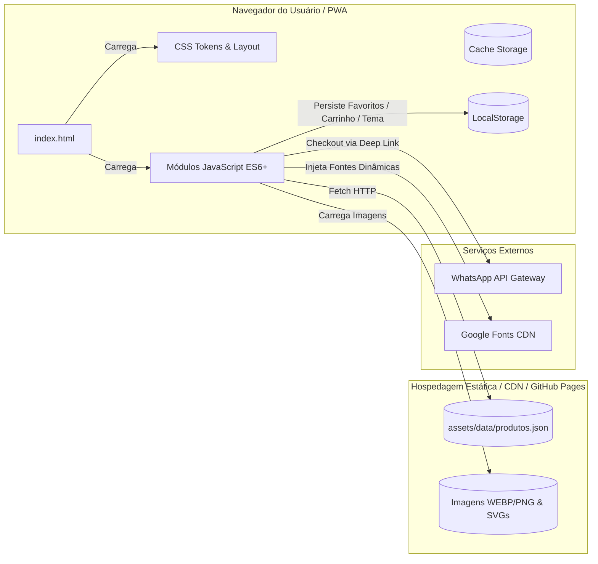
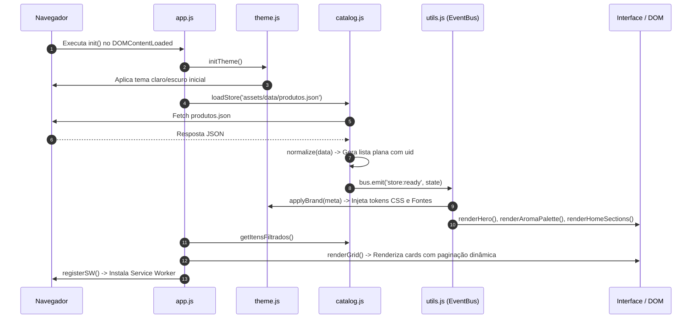

# 1. Visão Geral da Arquitetura e Filosofia do Sistema

[Voltar ao Índice](README.md) | [Próximo: Schema de Dados](data-schema.md)

---

## 1.1. Objetivo
Definir a fundação arquitetural do projeto **OLIVELAS**, detalhando as premissas de engenharia, restrições operacionais e padrões de design que tornam o sistema independente de servidores de backend tradicionais e livre de dependências externas em tempo de execução.

---

## 1.2. Visão Geral
O OLIVELAS é um catálogo de produtos e e-commerce headless baseado em PWA (*Progressive Web App*). O sistema adota a filosofia **Jamstack Zero-Build**, executando módulos nativos JavaScript (ESM) e CSS modular puro diretamente no navegador do cliente.

---

## 1.3. Responsabilidades
- **Arquitetura Zero-Build**: Garantir execução direta no browser sem Webpack, Vite, Babel ou Node.js runtime em produção.
- **Single Source of Truth**: Todos os dados do catálogo emanam de [`assets/data/produtos.json`](data-schema.md).
- **Desacoplamento por Eventos**: Toda comunicação entre UI, carrinho, favoritos e filtros é mediada por um Barramento de Eventos ([`utils.js: bus`](state-and-events.md)).
- **Resiliência Offline**: Operar normalmente mesmo quando o usuário perde a conexão, através de um Service Worker ([`sw.js`](pwa-and-offline.md)).

---

## 1.4. Fluxo Interno de Inicialização (Boot Lifecycle)

---

## 1.5. Relação com Outros Módulos
- Consome dados tratados de [`data-schema.md`](data-schema.md).
- Dispara eventos coordenados em [`state-and-events.md`](state-and-events.md).
- Governa o pipeline de renderização em [`catalog-engine.md`](catalog-engine.md).

---

## 1.6. Decisões Técnicas e Workarounds Documentados
1. **Decisão por Pure ES Modules**: Elimina etapas de build e dependências de pacotes vulneráveis (`node_modules`), garantindo longevidade extrema de manutenção.
2. **Separação de Tokens CSS**: Permite que uma edição nas propriedades `"corPrimaria"` ou `"corSecundaria"` dentro do JSON atualize instantaneamente a identidade visual do site sem tocar em uma única linha de CSS.

---

[Avançar para: 2. Schema de Dados](data-schema.md)
