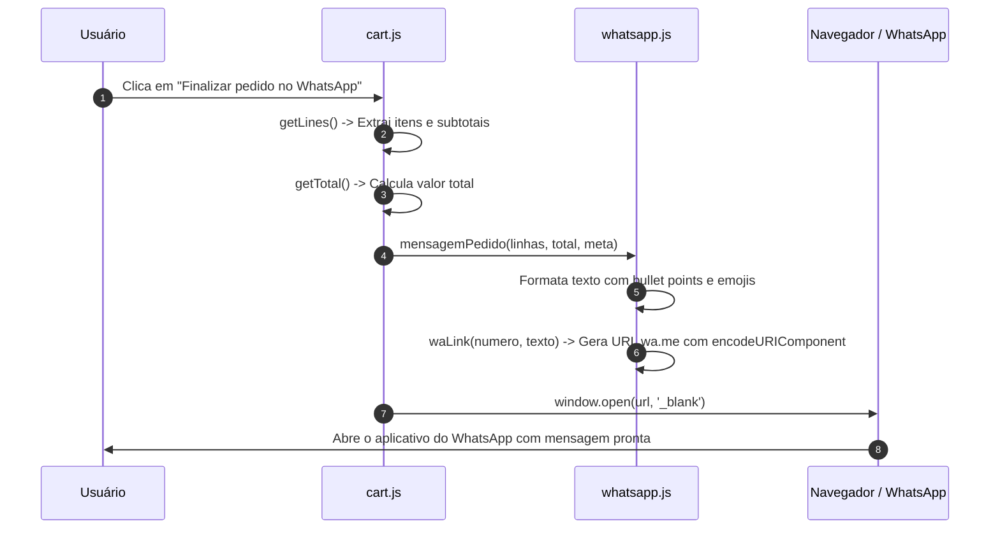

# 5. Carrinho de Compras, Favoritos e Trava de Estoque

[Anterior: Motor do Catálogo](catalog-engine.md) | [Voltar ao Índice](README.md) | [Próximo: Design System & UI](ui-and-design-system.md)

---

## 5.1. Objetivo
Documentar os mecanismos de persistência no `LocalStorage`, a trava de segurança para produtos com status `esgotado`, o fluxo de montagem do pedido para o WhatsApp e o gerenciamento da lista de favoritos desvinculada por variante (`uid`).

---

## 5.2. Carrinho de Compras (`cart.js`)

### Estrutura de Armazenamento
- Chave no LocalStorage: `olivelas:cart`
- Formato: Dicionário serializado em JSON mapeando `uid` para a quantidade inteira:
  ```json
  {
    "OV01-mini": 2,
    "OV05-padrao": 1
  }
  ```

### Trava de Segurança contra Produtos Esgotados e Em Breve:
A função de adição ao carrinho valida o status de disponibilidade do item antes de persistir, impedindo que itens `esgotado` ou `emBreve` sejam adicionados:
```javascript
export function isItemUnavailable(item) {
  return Boolean(
    item.esgotado ||
    item.emBreve ||
    (item.badge && (
      item.badge.toLowerCase().includes('breve') ||
      item.badge.toLowerCase().includes('esgotado')
    ))
  );
}
```
Itens indisponíveis exibem botão desabilitado na interface, enquanto o recurso de **Favoritos** permanece 100% livre para salvar qualquer item ou lançamento futuro na lista de desejos.

---

## 5.3. Lista de Favoritos (`favorites.js`)

### Estrutura de Armazenamento
- Chave no LocalStorage: `olivelas:favs`
- Formato: Array JSON contendo os `uid` favoritados:
  ```json
  ["OV01-mini", "OV09-padrao"]
  ```

### Regra de Independência entre Variantes:
Ao clicar no coração de favorito em `OV01-mini` (Verbena Mini 30g), apenas o identificador `OV01-mini` é inserido no `Set`. A variante `OV01-padrao` (Verbena Padrão 130g) permanece desmarcada, respeitando a intenção exata do cliente.

---

## 5.4. Diagrama de Checkout via WhatsApp



### Exemplo de Mensagem Formatada:
```text
Olá!
Gostaria de realizar o seguinte pedido (OLIVELAS):

• Verbena (Mini) — Quantidade: 2 — R$ 85,80
• Lavanda (Padrão) — Quantidade: 1 — R$ 88,90

Total estimado: R$ 174,70

Aguardo confirmação. Obrigado!
```

---

[Avançar para: 6. Design System & UI](ui-and-design-system.md)
