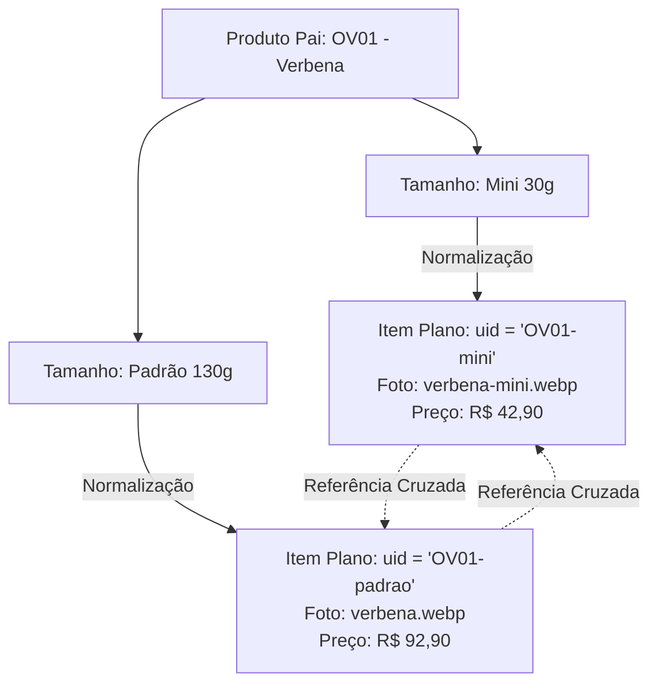

# 4. Motor do Catálogo: Normalização, Filtros, Busca e Paginação

[Anterior: Estado & Eventos](state-and-events.md) | [Voltar ao Índice](README.md) | [Próximo: Carrinho & Favoritos](cart-and-favorites.md)

---

## 4.1. Objetivo
Documentar o mecanismo de transformação de produtos em itens planos indexados por `uid`, o pipeline funcional de filtragem, a busca textual normalizada e o algoritmo de paginação dinâmica baseado nas colunas do CSS Grid.

---

## 4.2. Normalização Hierárquica para Itens Planos (`uid`)
Cada produto em `produtos.json` pode conter $N$ tamanhos. A função `normalize()` em [`catalog.js`](../assets/js/catalog.js) "achata" a hierarquia gerando uma lista plana onde cada registro representa uma variante comercializável:



### Regras de Normalização:
- `uid`: `${p.id || slugify(p.nome)}-${slugify(t.tipo)}`
- `imagem`: `t.imagem || p.imagem` (prioriza foto específica da variante)
- `esgotado`: `t.esgotado !== undefined ? t.esgotado : p.esgotado`
- `variantes`: Cada item contém referências às suas variantes irmãs com a flag `ativo: x.uid === v.uid`.

---

## 4.3. Pipeline de Filtragem Funcional
A função `getItensFiltrados()` executa um pipeline sequencial e puramente imutável:

```mermaid
graph LR
    A[state.itens (23 itens)] --> B{Filtro Categoria}
    B -->|categoria !== 'todos'| C{Filtro Favoritos}
    C -->|favoritos === true| D{Faixa de Preço}
    D -->|precoMin <= preco <= precoMax| E{Busca Textual}
    E -->|normText includes| F[Ordenação: sort]
    F --> G[Lista Final Filtrada]
```

### Busca Textual Invariante (`normText`):
A busca concatena `${i.nome} ${i.id} ${i.familia} ${i.categoriaNome}` e normaliza com decomposição NFD:
```javascript
export const normText = (s = "") =>
  s.normalize("NFD").replace(/\p{M}/gu, "").toLowerCase();
```
Isso permite encontrar a vela `Cravo e Canela` digitando `"cravo"`, `"canela"`, `"OV03"`, `"especiarias"` ou `"cravo e canela"` sem distinção de acentos ou caixa.

---

## 4.4. Paginação Dinâmica Inteligente Baseada em CSS Grid
Para evitar grades quebradas ou com espaços vazios na última linha, a aplicação calcula os tamanhos de página em função do número real de colunas computadas pelo navegador:

```javascript
function measureColumns() {
  const grid = $("#grid");
  if (!grid) return 4;
  const computed = getComputedStyle(grid).gridTemplateColumns;
  const cols = computed ? computed.split(" ").filter((t) => t && t !== "none").length : 0;
  return cols > 0 ? cols : 4;
}

function sizesFor(cols, total) {
  const step = cols * 2; // Sempre múltiplos de 2 linhas completas
  const opts = [];
  for (let s = step; s <= total; s += step) opts.push(s);
  if (opts[opts.length - 1] !== total) opts.push(total);
  return opts;
}
```

---

[Avançar para: 5. Carrinho & Favoritos](cart-and-favorites.md)
