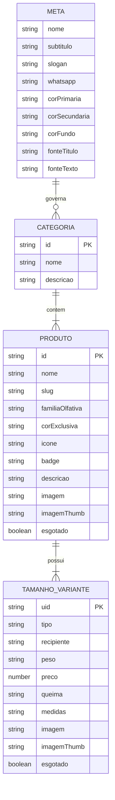

# 2. Especificação do Schema Central de Dados (`produtos.json`)

[Anterior: Arquitetura](architecture.md) | [Voltar ao Índice](README.md) | [Próximo: Estado & Eventos](state-and-events.md)

---

## 2.1. Objetivo
Documentar formalmente a estrutura de dados contida em `assets/data/produtos.json`, suas tipagens, restrições semânticas e o processo de transformação que o sistema realiza para gerar entidades consumíveis pela interface.

---

## 2.2. Visão Geral
O arquivo JSON central funciona como a base de dados relacional e institucional do projeto. Ele é dividido em quatro blocos estruturais principais:
1. **`meta`**: Metadados institucionais, informações de contato, horários e tokens de marca.
2. **`hero`**: Conteúdo da seção de abertura (título, subtítulo, CTA e imagem de fundo).
3. **`pilares`**: Lista de diferenciais da marca exibidos na página inicial.
4. **`categorias`**: Coleção de categorias, seus respectivos produtos e variantes de tamanho/embalagem.

---

## 2.3. Diagrama do Modelo de Dados



---

## 2.4. Especificação dos Campos

### Bloco `meta`
- `nome` (*string*): Nome fantasia exibido no header, footer e tags `<title>`.
- `whatsapp` (*string*): Telefone com DDI e DDD sem caracteres especiais (`5511963820374`).
- `corPrimaria` / `corSecundaria` / `corFundo` / `corApoio` (*string hex*): Injetadas no CSS como `--brand-ink`, `--brand-accent`, `--brand-paper` e `--brand-mist`.
- `fonteTitulo` / `fonteTexto` (*string*): Nomes de famílias do Google Fonts.

### Bloco `homeFeatured[]`
Seções editoriais temáticas renderizadas na página inicial:
- `id` (*string*): Identificador da seção (`"novidades"`, `"mais-vendidos"`, `"rituais"`).
- `eyebrow` (*string*): Subtítulo editorial (ex: `"Chegaram para ficar"`, `"Escolhidos por vocês"`, `"Para completar o ambiente"`).
- `title` (*string*): Título principal (ex: `"Novidades da casa"`, `"Os mais queridos"`, `"Pequenos rituais"`).
- `description` (*string*): Descrição do conceito da seleção.
- `tag` (*string*): Tag de correspondência para filtrar os produtos vinculados.

### Bloco `categorias[].produtos[]`
- `id` (*string*): Identificador curto do aroma/produto (ex: `"OV01"`, `"ARO1"`, `"ACC1"`, `"KIT01"`).
- `slug` (*string*): Identificador amigável em kebab-case usado para resolução de ícones e rotas (ex: `"verbena"`, `"blue-ocean"`).
- `esgotado` (*boolean*, opcional): Flag que define se o produto está sem estoque.
- `emBreve` (*boolean*, opcional): Flag que define lançamentos futuros ("Em breve").
- `badge` (*string*, opcional): Rótulo destacado (`"Mais vendido"`, `"Novo"`, `"Premium"`, `"Em breve"`, `"Esgotado"`).
- `tags` (*array de strings*, opcional): Tags temáticas para seções de destaque (ex: `["mais-vendidos"]`, `["novidades"]`, `["rituais"]`).
- `tamanhos` (*array*): Lista de variantes físicas do produto.

### Bloco `tamanhos[]` (Variantes)
- `tipo` (*string*): Nome da variante (ex: `"Mini"`, `"Padrão"`, `"Único"`, `"10 unidades"`).
- `preco` (*number*): Valor numérico em formato decimal (ex: `42.9`, `369.0`).
- `imagem` / `imagemThumb` (*string*): Caminhos para as fotos específicas daquela variante (ex: `assets/images/products/verbena-mini.webp`).
- `esgotado` / `emBreve` (*boolean*, opcional): Permite definir status individualizado por variante.

---

## 2.5. Exemplo de Registro Real

```json
{
  "id": "OV01",
  "nome": "Verbena",
  "slug": "verbena",
  "familiaOlfativa": "Frutal Verde",
  "corExclusiva": "#8EA487",
  "icone": "leaf",
  "badge": "Mais vendido",
  "tags": ["mais-vendidos"],
  "descricao": "Notas frescas e verdes que remetem a jardins ensolarados...",
  "imagem": "assets/images/products/verbena.webp",
  "imagemThumb": "assets/images/products/verbena-thumb.webp",
  "tamanhos": [
    {
      "tipo": "Mini",
      "recipiente": "Potinho de vidro",
      "peso": "40 g",
      "quantidade": 1,
      "preco": 42.9,
      "queima": "20 h",
      "medidas": "5 × 5 × 4 cm",
      "imagem": "assets/images/products/verbena-mini.webp",
      "imagemThumb": "assets/images/products/verbena-mini-thumb.webp",
      "esgotado": false
    },
    {
      "tipo": "Padrão",
      "recipiente": "Copo de vidro com tampa dourada",
      "peso": "230 g",
      "quantidade": 1,
      "preco": 92.9,
      "queima": "50 h",
      "medidas": "8 × 8 × 9 cm",
      "imagem": "assets/images/products/verbena.webp",
      "imagemThumb": "assets/images/products/verbena-thumb.webp",
      "esgotado": false
    }
  ]
}
```

---

[Avançar para: 3. Estado & Eventos](state-and-events.md)
