# 8. Pipeline de Mídia, Montagem 3D e Otimização de Ativos

[Anterior: Modal & Deep Linking](modal-and-routing.md) | [Voltar ao Índice](README.md) | [Próximo: PWA & Modo Offline](pwa-and-offline.md)

---

## 8.1. Objetivo
Documentar o pipeline matemático e computacional utilizado para processar, recortar com alfa puro, projetar em cilindro 3D as etiquetas das mini velas e exportar todos os ativos gráficos em alta performance (WEBP/PNG/SVG).

---

## 8.2. Montagem Cilíndrica das Mini Velas (`mount_mini_candle_labels.py`)

Para aplicar os rótulos 2D sobre o vidro do pote de 40g com realismo fotográfico, é aplicado um algoritmo de deformação cilíndrica (*cylindrical warp*):

```mermaid
graph LR
    RAW[Etiqueta 2D Original: 1254x1254] --> RESIZE[Redimensionamento Lanczos: 264x264]
    RESIZE --> WARP[Distorção Cilíndrica: theta = 30°]
    WARP --> SHADE[Shading de Iluminação Física]
    SHADE --> CORNER[Canto Arredondado: r = 6px]
    CORNER --> COMP[Composição sobre o Vidro com Sombra de Contato]
    COMP --> CANVAS[Canvas 1000x1000 Branco + Sombra Dupla]
    CANVAS --> EXPORT[Exportação: .webp Q95, .png e -thumb.webp Q90]
```

### Equações de Mapeamento:
1. **Posição Angular $	heta$**:
   $$	heta = rcsin\left(rac{x - w/2}{w/2} \cdot \sin(	heta_{max})
ight), \quad 	heta_{max} = rac{\pi}{6} pprox 30^\circ$$
2. **Atenuação de Luz Lateral (Shading)**:
   $$I(	heta) = 0.94 + 0.08 \cdot \cos(	heta)$$

---

## 8.3. Matriz de Ativos do Sistema

| Tipo de Ativo | Resolução | Formato | Caminho |
|---|---|---|---|
| Foto do Produto | 1000×1000 px | WEBP (Q95) / PNG | `assets/images/products/<slug>.webp` |
| Miniatura | 500×500 px | WEBP (Q90) | `assets/images/products/<slug>-thumb.webp` |
| Mini Vela (com etiqueta) | 1000×1000 px | WEBP / PNG | `assets/images/products/<slug>-mini.webp` |
| Logotipo Claro / Escuro | 500×500 px | SVG / PNG | `assets/images/logo-light.svg`, `logo-dark.svg` |
| Monograma Chama | 500×500 px | SVG | `assets/images/monogram.svg` |
| Capa Social OpenGraph | 1200×630 px | WEBP | `assets/images/og-cover.webp` |
| Ícones PWA | 16, 32, 180, 192, 512 px | PNG | `assets/images/icons/` |

---

[Avançar para: 9. PWA & Modo Offline](pwa-and-offline.md)
