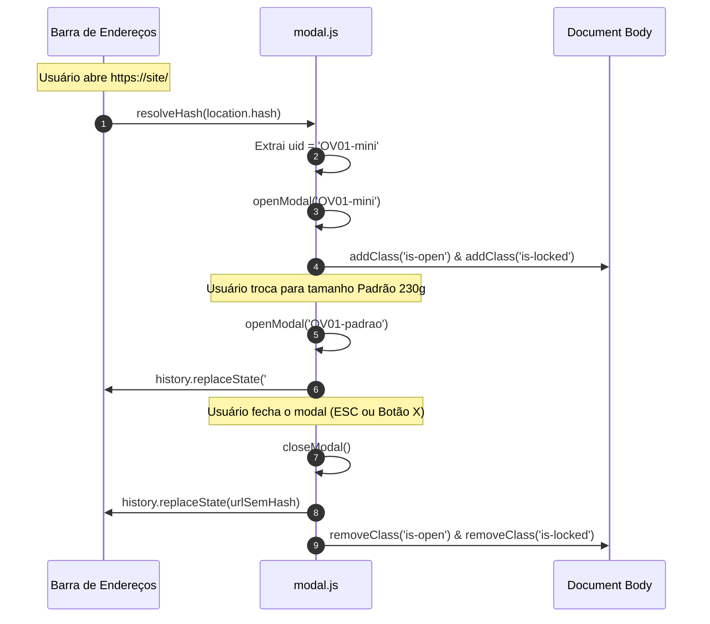

# 7. Modal de Produto, Deep Linking e Acessibilidade

[Anterior: Design System & UI](ui-and-design-system.md) | [Voltar ao Índice](README.md) | [Próximo: Pipeline de Mídia](media-pipeline.md)

---

## 7.1. Objetivo
Especificar o funcionamento do modal de detalhes do produto ([`assets/js/modal.js`](../assets/js/modal.js)), o roteamento por URL Hash (`#produto-<uid>`), a alternância dinâmica de variantes de tamanho e a armadilha de foco para acessibilidade (WCAG).

---

## 7.2. Deep Linking por URL Hash

O modal funciona como uma rota virtual navegável e compartilhável:



---

## 7.3. Acessibilidade e Focus Trap

Para garantir total conformidade com diretrizes de acessibilidade para leitores de tela e navegação por teclado:
1. Ao abrir o modal, o foco do teclado é direcionado ao botão de fechar (`#modal-close`).
2. Eventos de tecla `Tab` e `Shift+Tab` são capturados para impedir que o foco escape para o fundo da página:
   ```javascript
   function trapFocus(e) {
     if (e.key !== "Tab") return;
     const focusables = $$('[data-action], a[href], button:not([disabled])', modal);
     const first = focusables[0];
     const last = focusables[focusables.length - 1];
     if (e.shiftKey && document.activeElement === first) {
       e.preventDefault();
       last.focus();
     } else if (!e.shiftKey && document.activeElement === last) {
       e.preventDefault();
       first.focus();
     }
   }
   ```
3. A tecla `Escape` fecha o modal de qualquer ponto.

---

[Avançar para: 8. Pipeline de Mídia](media-pipeline.md)
