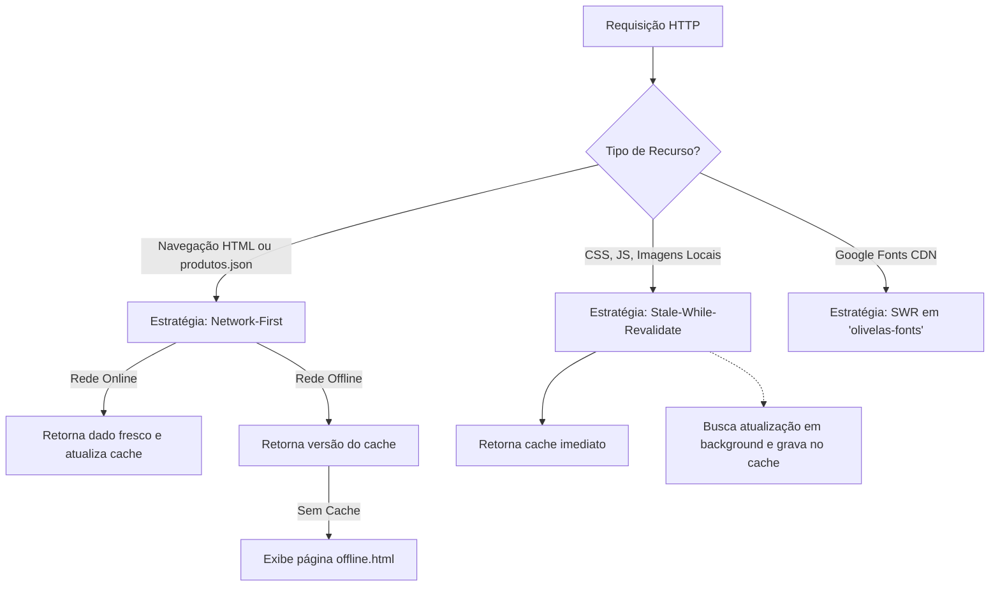

# 9. PWA, Service Worker e Resiliência Offline

[Anterior: Pipeline de Mídia](media-pipeline.md) | [Voltar ao Índice](README.md)

---

## 9.1. Objetivo
Documentar a estratégia de funcionamento progressivo (PWA), o ciclo de vida do Service Worker (`sw.js`), as políticas de cache diferenciadas por tipo de recurso e os mecanismos de contingência para falhas de rede.

---

## 9.2. Políticas de Cache no Service Worker

O Service Worker implementa duas estratégias complementares:



---

## 9.3. Manifesto Web (`manifest.webmanifest`)
Configurado para exibição em tela cheia (`display: "standalone"`) com atalhos de aplicativo:
- `"Ver catálogo"` -> direciona para `./#produtos`
- `"Falar no WhatsApp"` -> inicia contato direto
- Ícones maskable para adaptação perfeita a ícones redondos ou quadrados no Android e iOS.

---

## 9.4. Validação e Testes Automatizados (`test/unit.test.mjs`)
O sistema inclui suíte de testes unitários em Node.js cobrindo:
1. Normalização de dados e consistência de `uid`.
2. Filtros por categoria, preço e busca textual.
3. Formatação monetária e geradores de mensagem do WhatsApp.
4. Trava de produtos com classificação `esgotado`.
5. Separação de imagens e identificadores entre mini velas e velas padrão.

Para executar os testes:
```bash
node test/unit.test.mjs
```

---

[Voltar ao Início da Wiki (README.md)](README.md)
