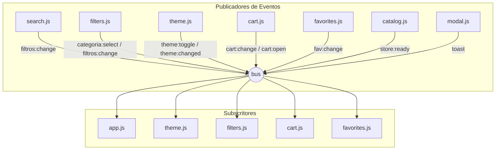

# 3. Gerenciamento de Estado, EventBus e Ciclo de Vida

[Anterior: Schema de Dados](data-schema.md) | [Voltar ao Índice](README.md) | [Próximo: Motor do Catálogo](catalog-engine.md)

---

## 3.1. Objetivo
Descrever o padrão de gerenciamento de estado reativo adotado na aplicação, detalhando o barramento de eventos pub/sub (`Emitter`) e os canais de comunicação desacoplados entre os componentes da interface.

---

## 3.2. Visão Geral
Para evitar acoplamento direto ou dependência de frameworks pesados (Redux, Vuex), o sistema implementa um **Micro EventBus** de alta performance em [`assets/js/utils.js`](../assets/js/utils.js). Todos os módulos subscrevem e publicam eventos através de uma única instância exportada `bus`.



---

## 3.3. Tabela Canônica de Eventos do Sistema

| Tópico do Evento | Payload | Módulo Emissor | Módulos Receptores | Descrição |
|---|---|---|---|---|
| `store:ready` | `state` | `catalog.js` | `theme.js`, `cart.js`, `app.js` | Disparado quando o JSON é baixado e normalizado com sucesso. |
| `filtros:change` | `state.filtros` | `catalog.js`, `filters.js` | `app.js`, `filters.js` | Notifica alteração na busca, categoria, preço ou favoritos. |
| `filtros:reset` | *(vazio)* | `app.js` | `filters.js`, `search.js` | Restaura todos os filtros aos valores padrão. |
| `categoria:select`| `catId` (string) | `filters.js`, `app.js` | `catalog.js`, `search.js` | Altera a categoria ativa do catálogo. |
| `theme:toggle` | *(vazio)* | `app.js` | `theme.js` | Solicita alternância entre claro e escuro. |
| `theme:changed` | `"light"` \| `"dark"` | `theme.js` | `app.js` | Notifica mudança de tema para atualizar `<meta name="theme-color">`. |
| `cart:change` | `{ count, total }` | `cart.js` | `app.js` | Atualiza o contador de itens no header e totais. |
| `cart:open` / `cart:close` | *(vazio)* | `app.js` | `cart.js` | Controla abertura e fechamento da gaveta do carrinho. |
| `fav:change` | `{ ids }` | `favorites.js` | `app.js`, `favorites.js` | Notifica alteração no conjunto de favoritos. |
| `toast` | `{ type, text }` | Qualquer módulo | `app.js` | Exibe notificação flutuante com deduplicação temporal. |

---

## 3.4. Implementação do `Emitter` em `utils.js`

```javascript
class Emitter {
  constructor() {
    this._map = new Map();
  }
  on(event, fn) {
    if (!this._map.has(event)) this._map.set(event, new Set());
    this._map.get(event).add(fn);
    return () => this.off(event, fn); // Retorna função de desinscrição limpa
  }
  off(event, fn) {
    this._map.get(event)?.delete(fn);
  }
  emit(event, payload) {
    this._map.get(event)?.forEach((fn) => fn(payload));
  }
}

export const bus = new Emitter();
```

---

[Avançar para: 4. Motor do Catálogo](catalog-engine.md)
